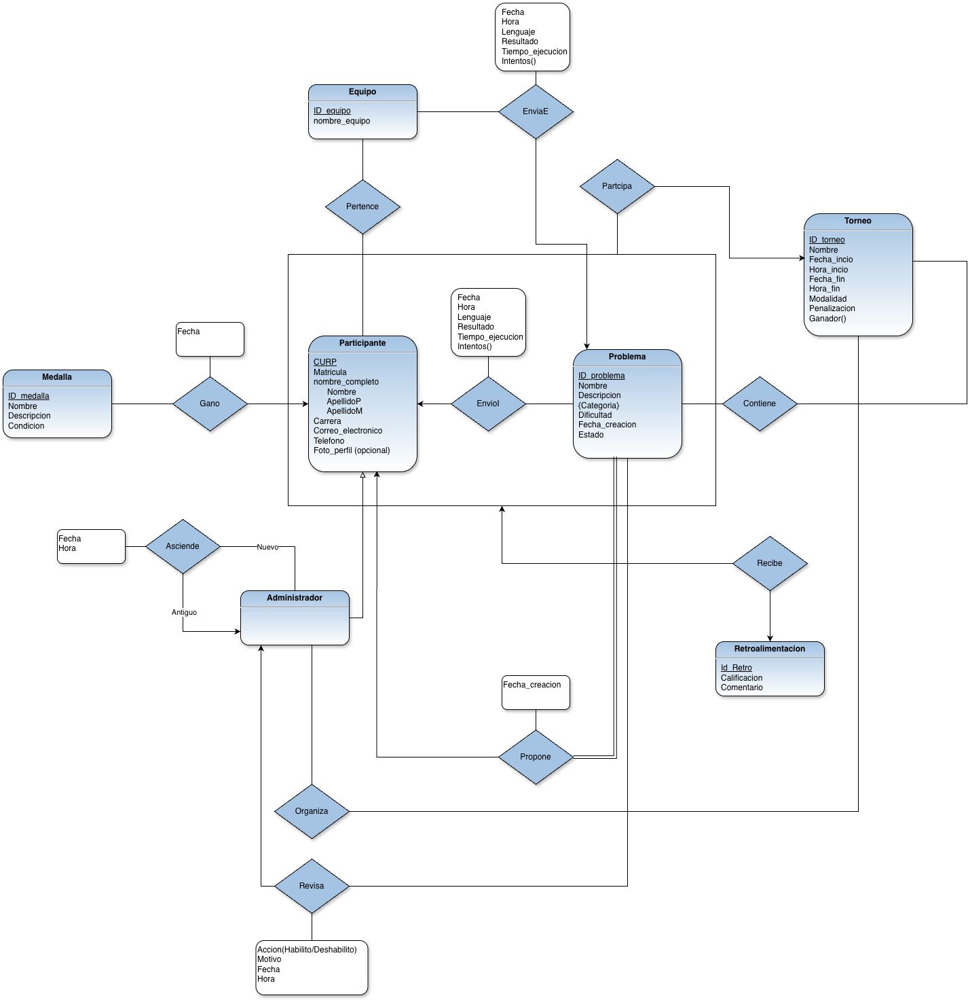

# Tournament Management System - Database Design

A comprehensive relational database system designed to manage competitive programming tournaments. This project focuses on data integrity, complex relational mapping, and performance tracking for high-stakes competitions.

## 🚀 Key Features
- **Participant & Team Management:** Tracks detailed user data, roles (Administrators/Participants), and team affiliations.
- **Problem & Category System:** Organizes coding challenges by difficulty, category, and status.
- **Live Submission Tracking:** Logs every code submission including programming language, execution time, result, and attempts.
- **Feedback & Awards:** Integrated system for judge feedback (Retroalimentación) and automated medal tracking.

## 🛠️ Technical Stack
- **Database:** MariaDB / MySQL 8.4
- **Modeling:** Relational Schema with optimized foreign keys and indexing.
- **Tools:** SQL Dump for easy deployment.

## 📊 Database Schema Highlights
The system includes specialized tables for:
- `enviae` & `enviol`: Managing team and individual submissions.
- `gano` & `medalla`: Handling achievement logic.
- `revisa`: Tracking administrator actions and problem moderation.

## 🏁 How to use
1. Clone the repository.
2. Import the `proyecto_final_estructura.sql` file into your MySQL/MariaDB server.
3. Explore the relationships and sample queries.

## 📈 Example Query: Tournament Leaderboard
-- This query retrieves the top teams based on successful submissions
SELECT e.nombre_equipo, COUNT(env.ID_problema) AS problems_solved
FROM equipo e
JOIN enviae env ON e.ID_equipo = env.ID_equipo
WHERE env.resultado = 'Accepted'
GROUP BY e.nombre_equipo
ORDER BY problems_solved DESC;

## 🗺️ Entity-Relationship Diagram (ERD)

